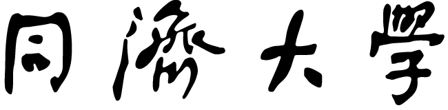
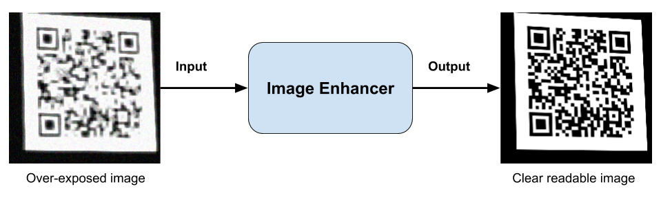

# Bachelor Thesis

---

Title

- ML-Based Image Enhancement of Low-Quality QR Code Images for Fast Data Decoding

# Aims

The current research aim is to construct a fast system to enhance the quality of QR Code images to improve the
decoding success rate, hence decreasing the time required to read the data contained in 2D bar
codes. The system is an Convolutional Neural Network (CNN) with a structure of an auto-encoder,
trained with a TensorFlow toolkit on self-generated images. The input is an image with a poor
resolution and quality and the output is a clear, noise-less picture of the same QR Code. The output of
the CNN can then be used to decode the QR Code’s data with any preferred decoding algorithm.
The system has been deployed on the Raspberry Pi 3B+ and evaluated in different simulation
obtaining an increase of about +100% success rate of correct decoding of low-quality QR Code
images.

|       System        |                                                                 2.7                                                                 |                                                                                                                 3.5                                                                                                                 |                                                                                                 3.6                                                                                                 |
| :-----------------: | :---------------------------------------------------------------------------------------------------------------------------------: | :---------------------------------------------------------------------------------------------------------------------------------------------------------------------------------------------------------------------------------: | :-------------------------------------------------------------------------------------------------------------------------------------------------------------------------------------------------: |
|      Linux CPU      |  |                                                                                                  |                                                                                         
—
                                                                                          |
|      Linux GPU      |  |                                                                                                  |                                                                                         
—
                                                                                          |
|  Windows CPU / GPU  |                                                         
—
                                                          |  |                                                                                         
—
                                                                                          |
| Linux (ppc64le) CPU |                                                         
—
                                                          |                                                                                                         
—
                                                                                                          |                      |
| Linux (ppc64le) GPU |                                                         
—
                                                          |                                                                                                         
—
                                                                                                          |  |

---

### Image Enhancement

- Image De-Blur and Enhancement

# Convolutional neural network Model

- The enhancer developed is based on a Convolutional Neural Network or in short CNN, trained
  from zero and built on a structure usually referred as auto-encoder. CNNs are particular kinds of
  Neural Networks (NN) which simulate the convolution operation. The convolution I\*K between an
  input matrix I and another matrix, the kernel or filter, K is obtained by translate pixel-by-pixel the
  kernel

